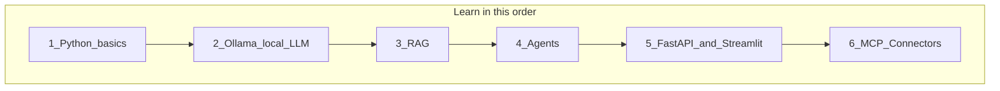

# Learning Path: Tech Stack for Org Chat Kit

> **Read this before [VISION.md](VISION.md).**  
> You know TypeScript — this guide teaches Python, Ollama, RAG, agents, FastAPI, and connectors in the right order, using this repo as your lab.

---

## How to use this doc

1. Follow the phases **in order** — each builds on the previous one  
2. Run commands in your cloned repo: `git clone https://github.com/yellaiahvemula/org-chat-kit.git`  
3. Check off items as you complete them  
4. Only move to MCP/connectors after Phase 5  

**Time:** Part-time, self-paced. Focus on understanding + doing, not speed.

---

## The stack at a glance



| Technology | What it is | TS equivalent you know |
|------------|------------|------------------------|
| **Python** | Language for AI/RAG/agents | JavaScript/TypeScript |
| **Ollama** | Runs LLMs locally on your machine | Like running a local API server |
| **RAG** | Search docs first, then answer | No direct equivalent — new concept |
| **Agent** | LLM + tools in a loop | Like calling multiple API endpoints from one orchestrator |
| **FastAPI** | Python web API framework | Express.js |
| **Streamlit** | Chat UI in pure Python | Quick alternative to React for demos |
| **MCP / Connectors** | Standard wrappers around dept APIs | Like typed API clients exposed as "tools" |

---

## Phase 1: Python essentials (Week 1–2)

You do **not** need to become a Python expert. Learn only what this project uses.

### 1.1 Environment

```bash
cd org-chat-kit
python3 --version          # need 3.10+
pip install -r requirements.txt
export PYTHONPATH=python   # add to ~/.bashrc for convenience
```

**Concept:** `PYTHONPATH=python` lets you run `python -m rag.ingest` — modules live under `python/`.

### 1.2 Syntax you need (vs TypeScript)

| Python | TypeScript |
|--------|------------|
| `def foo(x: str) -> dict:` | `function foo(x: string): Record<string, unknown>` |
| `import x from y` / `from y import x` | `import x from 'y'` |
| `if __name__ == "__main__":` | Entry point (like `if (require.main === module)`) |
| `with open("f.txt") as f:` | `fs.readFileSync` with auto-close |
| `for item in items:` | `for (const item of items)` |
| `None` | `null` |
| `True` / `False` | `true` / `false` |
| Indentation = blocks (no `{}`) | Braces for blocks |
| `list`, `dict` | `array`, `object` |
| `pathlib.Path` | `path` from Node |

### 1.3 Files to read (in order)

| File | Learn |
|------|-------|
| `python/shared/config.py` | Loading YAML, env vars, paths |
| `python/rag/ingest.py` | CLI with `argparse`, calling functions |
| `org-config/msme-demo/branding.yaml` | Per-org config pattern |

### 1.4 Exercises

- [ ] Change `display_name` in `org-config/msme-demo/branding.yaml`, run ingest again  
- [ ] Add a `print()` in `rag/ingest.py` and see it when you run ingest  
- [ ] Run: `python -m shared.llm` and read the JSON output  

### 1.5 Skip for now

PyTorch, pandas, Django, async deep dives, data science math.

---

## Phase 2: Ollama — local LLM (Week 2–3)

**What:** Ollama runs open-source language models on your laptop/server. No OpenAI bill, data stays local.

**Why learn it first:** You can experiment for free before paying for APIs. Critical for govt/data-residency thinking.

### 2.1 Install and run

```bash
# Install from https://ollama.com/download
./scripts/setup-ollama.sh    # pulls llama3.2 + nomic-embed-text
./scripts/start-ollama.sh    # background service

cp .env.ollama.example .env
# LLM_PROVIDER=ollama
```

Verify:

```bash
python -m shared.llm
curl http://localhost:11434/api/tags
ollama run llama3.2 "What is 2+2?"
```

### 2.2 Two models, two jobs

| Model | Role in your project |
|-------|----------------------|
| `llama3.2` (chat) | Writes answers, decides which tools to call |
| `nomic-embed-text` (embedding) | Converts text to vectors for document search |

### 2.3 How it connects to code

Read: `python/shared/llm.py` and `python/shared/embeddings.py`

- Ollama exposes an **OpenAI-compatible API** at `http://localhost:11434/v1`
- Same Python code works for OpenAI or Ollama — switch via `LLM_PROVIDER` in `.env`

### 2.4 Exercises

- [ ] Chat with `ollama run llama3.2` in terminal  
- [ ] Run `python -m shared.llm` — confirm `llm_available: true`  
- [ ] Re-ingest after switching to Ollama: `rm -f data/vector-store.json && python -m rag.ingest --org msme-demo`  
- [ ] Try `qwen2.5:3b` for Hindi: `ollama pull qwen2.5:3b`, set `OLLAMA_MODEL=qwen2.5:3b`  

### 2.5 Concepts to understand

- **Prompt** — text you send to the model  
- **Temperature** — low (0–0.3) = factual; high = creative  
- **Context window** — max text the model can read at once (why we need RAG)  
- **Token** — roughly a word/piece of text; models count these  

---

## Phase 3: RAG — Retrieval Augmented Generation (Week 3–5)

**What:** Search your org documents first, then ask the LLM to answer using only what was found.

**Why:** Govt circulars are huge. You can't paste them all into a prompt. RAG finds the right paragraphs.

### 3.1 The flow

```
Documents → Chunk → Embed → Store in vector DB
                                    ↓
User question → Embed → Find similar chunks → LLM + chunks → Answer with citations
```

### 3.2 Files to read (in order)

| File | What it does |
|------|--------------|
| `python/rag/chunker.py` | Splits markdown by sections |
| `python/rag/ingest.py` | Reads docs, embeds, stores |
| `python/shared/vector_store.py` | Saves/searches vectors |
| `python/rag/query.py` | Retrieves chunks + generates answer |

### 3.3 Commands

```bash
python -m rag.ingest --org msme-demo
python -m rag.query --org msme-demo "What is UDYAM registration?"
python -m rag.query --org msme-demo "What is PMEGP?"
```

### 3.4 Key concepts

| Term | Meaning |
|------|---------|
| **Chunk** | Small piece of a document (e.g. one section) |
| **Embedding** | List of numbers representing text meaning |
| **Vector search** | Find chunks most similar to the question |
| **Citation** | Answer references source document name |
| **Hybrid search** | Vector + keyword matching combined |

### 3.5 Exercises

- [ ] Add a new `.md` file to `org-config/msme-demo/documents/`, re-ingest, query it  
- [ ] Read `eval-questions.jsonl` — understand eval format  
- [ ] Ask a question **not** in docs — see "I don't have enough information"  
- [ ] Draw the RAG flow on paper from memory  

---

## Phase 4: Agents — LLM + tools (Week 5–7)

**What:** An agent doesn't just answer — it **decides** to call tools (search docs, check API status, create ticket).

**TS analogy:** Like a function that sometimes `fetch()`es your API, sometimes searches a local cache, based on the user's question.

### 4.1 The loop

```
User question → LLM thinks → "I need tool X" → Run tool → LLM sees result → Final answer
```

### 4.2 Files to read

| File | What it does |
|------|--------------|
| `python/agent/tools.py` | Three tools + definitions |
| `python/agent/agent.py` | ReAct loop, guardrails |
| `org-config/msme-demo/system-prompt.md` | Rules for the agent |
| `org-config/msme-demo/tools.yaml` | Which tools are enabled |

### 4.3 The three demo tools

| Tool | Simulates |
|------|-----------|
| `search_knowledge_base` | RAG over documents |
| `get_business_registration_status` | Department API (UDYAM lookup) |
| `create_support_ticket` | Grievance/ticket API |

**This is the seed of your connector idea** — each tool will later become a real API call via MCP.

### 4.4 Commands

```bash
python -m agent.run --org msme-demo "What is PMEGP?"
python -m agent.run --org msme-demo "Check UDYAM-MH-01-0001234 status"
python -m agent.run --org msme-demo "Create a support ticket" --json
```

### 4.5 Concepts

| Term | Meaning |
|------|---------|
| **Tool / function calling** | LLM returns structured "call this function with these args" |
| **ReAct** | Reason + Act loop (industry default pattern) |
| **Guardrails** | Block PII, refuse out-of-scope, escalate when unsure |
| **System prompt** | Instructions that define behavior and limits |

### 4.6 Exercises

- [ ] Trace one chat message through `agent.py` with print statements  
- [ ] Edit `system-prompt.md` to change tone (formal vs friendly)  
- [ ] Add a fourth mock tool in `tools.py` (e.g. `get_scheme_list`)  
- [ ] Understand difference: RAG answers from docs; tools call external logic  

---

## Phase 5: FastAPI + Streamlit (Week 7–9)

Now expose the agent to the world — API for integrations, UI for demos.

### 5.1 Streamlit first (easier)

**What:** Python-only chat page. No HTML/React.

```bash
python run_ui.py
# → http://localhost:8501
```

Read: `app/streamlit_ui.py` (~60 lines)

**Exercise:** Change sidebar title or add a "example questions" button.

### 5.2 FastAPI (API layer)

**What:** REST API — like Express for Python.

```bash
python run_api.py
# → http://localhost:8000/docs  (interactive Swagger UI)
```

Read: `app/api.py` — see [previous explanation in chat] or walk through endpoints:

| Endpoint | Purpose |
|----------|---------|
| `GET /health` | Alive check |
| `POST /api/chat` | Send message → agent response |
| `POST /api/auth/login` | Get JWT token |
| `GET /api/audit` | Officer-only logs |

**TS mapping:**

```python
@app.post("/api/chat")          # app.post('/api/chat', ...)
def chat(req: ChatRequest):     # req: ChatRequest = typed body
    ...                         # like zod-validated body
```

### 5.3 Exercises

- [ ] Open `/docs`, test `POST /api/chat` with Swagger UI  
- [ ] Login as officer, copy token, call `/api/audit` with `Authorization: Bearer <token>`  
- [ ] Compare: Streamlit calls agent directly; FastAPI wraps same agent for HTTP clients  
- [ ] `curl` the chat endpoint from terminal  

### 5.4 When to use which

| Use Streamlit | Use FastAPI |
|---------------|-------------|
| Learning, demos, internal pilots | Production, mobile apps, WhatsApp webhooks |
| You want UI fast | Another system will call your agent |

---

## Phase 6: MCP & Connectors (Week 9+)

**Only start this after Phases 1–5.** This is your [VISION](VISION.md) endgame.

### 6.1 What is a connector?

A **connector** = code that wraps one department API as one or more **tools** the agent can call.

```
Department API:  GET /api/v1/udyam/{id}/status
                        ↓
Connector tool:  get_udyam_status(registration_number: str)
                        ↓
Agent:           "User asked about UDYAM-MH-01-0001234" → calls tool → speaks result
```

Today in the repo, `get_business_registration_status` in `tools.py` is a **mock connector**. Later it becomes a real HTTP call.

### 6.2 What is MCP?

**MCP (Model Context Protocol)** = standard way to package connectors so any AI app can use them.

Instead of hardcoding tools in `tools.py`, you run an **MCP server** per department:

```
Agent → MCP Client → MCP Server (labour-dept) → Labour Dept REST API
                  → MCP Server (msme)        → MSME Portal API
```

**Why MCP:** Reusable across Cursor, your agent, future products. One connector, many hosts.

### 6.3 Learning order for connectors

1. Replace mock in `tools.py` with real `httpx.get("https://api...")`  
2. Learn MCP Python SDK — expose same function as MCP tool  
3. Define connector config YAML (base URL, auth, tool list)  
4. Read [VISION.md](VISION.md) Phase B roadmap  

### 6.4 Connector concepts (preview)

| Concept | Meaning |
|---------|---------|
| **Tool** | One callable function (search, status, create ticket) |
| **Auth plugin** | API key, OAuth2 — stored in secrets, not in prompts |
| **Adapter** | Maps messy dept API response → clean tool response |
| **Audit** | Log every API call for govt compliance |

---

## Recommended weekly schedule

| Week | Focus | Done when |
|------|-------|-----------|
| 1 | Python syntax + run ingest/query CLI | You can read `config.py` and `ingest.py` comfortably |
| 2 | Ollama install + local LLM | `shared.llm` shows available; answers work offline |
| 3 | RAG deep dive | You added a doc and get cited answers |
| 4 | RAG eval + chunking concepts | You understand why chunking matters |
| 5 | Agent tools | You traced a tool call end-to-end |
| 6 | System prompts + guardrails | You edited prompt and saw behavior change |
| 7 | Streamlit UI | You ran chat in browser |
| 8 | FastAPI + `/docs` | You called API with curl and Swagger |
| 9+ | Mock → real HTTP tool | One tool calls a real public API |
| 10+ | MCP intro | Read MCP spec; one MCP tool working |

---

## Learning resources

### Python (minimal)
- [Python official tutorial](https://docs.python.org/3/tutorial/) — Sections 1–9 only  
- Your repo code — best teacher for this project  

### Ollama
- [ollama.com](https://ollama.com)  
- `python -m shared.llm` in this repo  

### RAG & Agents
- [DeepLearning.AI short courses](https://www.deeplearning.ai/short-courses/) — free, short  
- This repo's `python/rag/` and `python/agent/`  

### FastAPI
- [fastapi.tiangolo.com/tutorial](https://fastapi.tiangolo.com/tutorial/) — first 5 sections  
- Your `app/api.py` side-by-side with tutorial  

### MCP
- [modelcontextprotocol.io](https://modelcontextprotocol.io) — read after Phase 5  
- [VISION.md](VISION.md) — your project's connector direction  

---

## Checklist before starting VISION work

- [ ] I can run ingest, query, and agent from CLI  
- [ ] I understand what a chunk and embedding are  
- [ ] I know the difference between RAG and a tool  
- [ ] Ollama works locally OR I have OpenAI key working  
- [ ] I ran Streamlit chat and FastAPI `/docs`  
- [ ] I read [VISION.md](VISION.md) once  
- [ ] I can explain "API not database" in one sentence  

When all checked — you're ready to build your first real connector.

---

## One sentence per technology (memorize these)

| Tech | One sentence |
|------|--------------|
| **Python** | The language your agent, RAG, and API are written in. |
| **Ollama** | Runs the AI model on your machine; no cloud API needed. |
| **RAG** | Search documents first, then answer from what you found. |
| **Agent** | AI that picks which tools to call, not just chat. |
| **FastAPI** | HTTP API so other apps can talk to your agent. |
| **Streamlit** | Quick chat webpage without building React. |
| **Connector** | Wrapper that turns a department API into an agent tool. |
| **MCP** | Standard packaging for connectors so any AI app can plug in. |

---

*Next doc to read after completing Phase 5: [VISION.md](VISION.md)*
