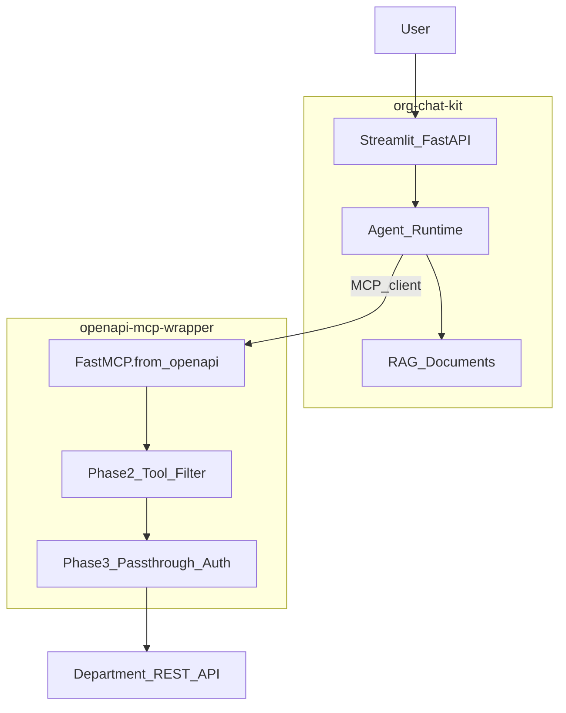

# OpenAPI-to-MCP Wrapper — Architecture & Roadmap

> **Companion project:** [openapi-mcp-wrapper](https://github.com/yellaiahvemula/openapi-mcp-wrapper)  
> **Parent vision:** [VISION.md](VISION.md)  
> **Learning path:** [LEARNING.md](LEARNING.md) (complete Phases 1–5 before Phase 2 here)

---

## What This Is

An **OpenAPI-to-MCP wrapper** automatically converts a department's REST API (via its OpenAPI/Swagger spec) into standard **MCP tools** that any AI agent can call.

```
Department openapi.json  →  FastMCP.from_openapi()  →  MCP Server  →  Agent
                                    ↓
                          Department REST API (no database)
```

**One-liner pitch:**
> *Turn any department's REST API into AI agent tools automatically — no database access, user permissions preserved.*

---

## Why This Exists (Link to VISION)

[VISION.md](VISION.md) defines the overall goal: agents + MCP for govt/MSME, API-only integration.

**The hard part** of that vision is building MCP connectors per department. Hand-writing each tool is slow and doesn't scale.

**This project solves:** auto-generate connectors from OpenAPI specs departments already publish (or can publish).

| Manual approach (org-chat-kit today) | OpenAPI wrapper (this project) |
|--------------------------------------|--------------------------------|
| Write each tool in `tools.py` | `FastMCP.from_openapi(spec)` |
| One connector = days of work | One connector = paste OpenAPI URL |
| Good for learning | Good for scaling |

---

## Two-Repo Ecosystem



| Repository | Role |
|------------|------|
| **[org-chat-kit](https://github.com/yellaiahvemula/org-chat-kit)** | Agent, RAG, UI, org config, audit |
| **[openapi-mcp-wrapper](https://github.com/yellaiahvemula/openapi-mcp-wrapper)** | Auto-generate MCP tools from OpenAPI |

---

## Tech Stack

| Component | Choice | Why |
|-----------|--------|-----|
| MCP framework | **FastMCP** | Native `from_openapi()` — no manual tool codegen |
| HTTP client | **httpx** | Async calls to department APIs |
| Validation | **pydantic** | Config + runtime type safety |
| Config | **YAML** | Per-department connector files |
| IDE | **Cursor** | MCP host for testing connectors |

---

## Four-Phase Roadmap

### Phase 1: Core Conversion (POC) ✅

**Goal:** Load `openapi.json`, auto-generate MCP tools, run over stdio.

```python
import httpx
from fastmcp import FastMCP

client = httpx.AsyncClient(base_url="https://api.dept.gov.in")
spec = httpx.get("https://api.dept.gov.in/openapi.json").json()

mcp = FastMCP.from_openapi(openapi_spec=spec, client=client, name="Dept API")
mcp.run()  # stdio — connect from Cursor
```

**POC target:** Swagger Petstore (public, no auth)  
**Repo:** `python server.py --example petstore`

**Success criteria:**
- [x] OpenAPI spec loads
- [x] MCP tools auto-generated
- [x] Connectable from Cursor MCP config
- [ ] One tool call returns real API data (verify in Cursor)

---

### Phase 2: Dynamic Tool Filtering 🔲

**Problem:** Department APIs with 50+ endpoints overwhelm the agent context window and cause wrong tool selection.

**Solution:** Semantic vector search over tool **names + descriptions** — return only top-k relevant tools per user query.

```
User: "Check my application status"
  → Embed query
  → Search 80 tool descriptions
  → Return top 5: get_application_status, get_application_by_id, ...
  → Agent sees only 5 tools, picks correctly
```

**Implementation:** `filtering/tool_retriever.py` (stub exists)  
**Reuse:** Same embedding patterns as org-chat-kit RAG (`python/shared/embeddings.py`)

---

### Phase 3: Pass-Through Auth 🔲

**Problem:** Service account with elevated permissions is unacceptable for govt.

**Solution:** Forward the **logged-in user's** `Authorization: Bearer <token>` on every API call.

```
Citizen logs in → JWT (read-only scopes)
  → Agent calls MCP tool
  → MCP forwards citizen's token to dept API
  → API enforces RBAC — agent cannot escalate
```

**Implementation:** `auth/passthrough.py` (stub exists)  
**FastMCP support:** Configure auth on `httpx.AsyncClient` + `AuthMiddleware`

**Pitch to departments:** *"The agent never has more access than the user sitting at the keyboard."*

---

### Phase 4: Admin Portal 🔲

**Goal:** Web UI where teams paste an OpenAPI URL, refine tool descriptions with an LLM, and monitor API tool executions.

**Features:**
- Paste OpenAPI URL → preview generated tools
- LLM-refine cryptic auto-generated descriptions
- Enable/disable endpoints (visual RouteMap builder)
- Execution log dashboard

**When:** After Phase 1–3 work with one real department API.  
**For govt pilots:** Manual YAML config is fine initially.

---

## Security Defaults (Built In)

| Rule | Implementation |
|------|----------------|
| No DELETE by default | `exclude_methods: [DELETE]` in config |
| Exclude auth endpoints | `exclude_paths: ["^/user/login$"]` |
| No DB access | Architecture — HTTP only |
| User-scoped auth | Phase 3 pass-through |
| Timeout on all calls | `timeout: 30.0` in config |

**Always whitelist** sensitive admin paths via `exclude_paths` before exposing to agents.

---

## Connector Config Format

`examples/petstore.yaml`:

```yaml
name: petstore-demo
openapi_url: https://petstore3.swagger.io/api/v3/openapi.json
base_url: https://petstore3.swagger.io/api/v3
exclude_paths:
  - "^/user/login$"
exclude_methods:
  - DELETE
timeout: 30.0
```

Per department: copy template → set URLs → add exclusions → deploy MCP server container.

---

## Connecting to org-chat-kit Agent

Today org-chat-kit uses mock tools in `python/agent/tools.py`.

**Future integration (VISION Phase B):**

```yaml
# org-config/msme-demo/tools.yaml
mcp_servers:
  - name: msme-portal
    command: python
    args: ["/path/to/openapi-mcp-wrapper/server.py", "--config", "connectors/msme-portal.yaml"]
```

Agent loads tools dynamically from MCP instead of hardcoded Python functions.

---

## Known Limitations

| Limitation | Mitigation |
|------------|------------|
| Not all dept APIs have OpenAPI | Manual tool definitions in org-chat-kit as fallback |
| Auto-generated tool names are ugly | Phase 4 LLM description refinement; RouteMap aliases |
| GraphQL APIs | Different connector pattern (future) |
| mTLS / API gateways | Per-connector auth plugin in Phase 3 |
| Large specs (100+ endpoints) | Phase 2 semantic filtering required |

---

## Learning Order

1. Complete [LEARNING.md](LEARNING.md) Phases 1–4 (Python, Ollama, RAG, Agents)
2. Run openapi-mcp-wrapper Phase 1 POC with Petstore
3. Connect Petstore MCP to Cursor — call a tool manually
4. Replace one mock tool in org-chat-kit with real MCP connector
5. Phase 2–3 as you approach a real department pilot

---

## Related Documents

| Doc | Purpose |
|-----|---------|
| [VISION.md](VISION.md) | Overall product vision |
| [LEARNING.md](LEARNING.md) | Tech stack learning path |
| [openapi-mcp-wrapper README](https://github.com/yellaiahvemula/openapi-mcp-wrapper) | Repo quick start |

---

*This document captures the Gemini-assisted architecture plan, validated and integrated with the org-chat-kit vision. Update as phases complete.*
