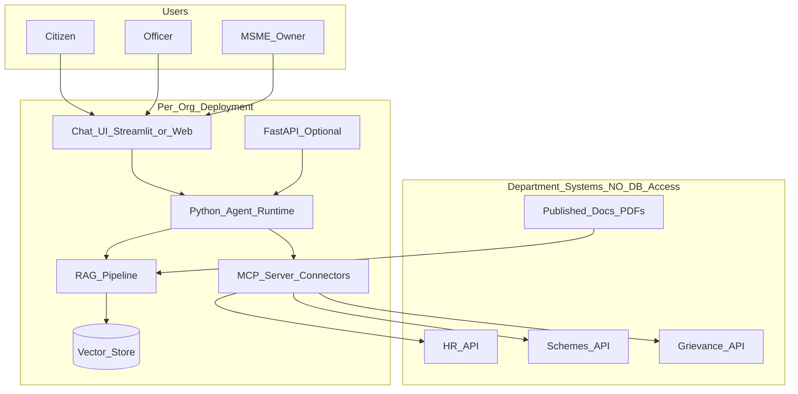

# Vision: AI Agent + MCP Framework for Department APIs

> **Personal interest project** — a living document to capture the core idea, analysis, and direction for future deep dives.  
> Last updated: September 2026

---

## Core Idea (One Paragraph)

Build an **AI Agent and MCP connector framework** that gives government departments and MSMEs a conversational interface over **their existing APIs** — not direct access to secure databases. Each org gets a custom deployment: an agent runtime (Python), RAG over public documents (circulars, schemes, FAQs), and **MCP servers** that wrap department APIs as tools (`get_application_status`, `file_grievance`, `search_circulars`). Same framework, different connectors per department.

---

## Why This Idea Is Strong

### 1. Security and compliance

Government systems rarely allow external agents to connect to production databases. **APIs are the intended integration surface.**

| Direct database access | API-based access (our approach) |
|------------------------|----------------------------------|
| Requires DB credentials, VPN, firewall exceptions | Uses existing API gateway / OAuth |
| Hard to audit per query | Every call logged by the department's API layer |
| High security review burden | Easier pitch: "We use your published API only" |
| One breach = full data exposure | Scoped tokens, rate limits, per-endpoint permissions |

**Positioning for departments:**  
*"Our agent calls your existing REST API with a service account. We do not need database access."*

### 2. MCP fits the connector model

**MCP (Model Context Protocol)** is a standard way to expose tools to AI applications — like USB for AI integrations.

```
User → AI Agent → MCP Server (per dept) → Department APIs
                → RAG (documents only, no DB)
```

Each department gets:
- **MCP tools** — thin wrappers over their APIs
- **RAG** — policies, circulars, scheme guides (PDFs/FAQs)
- **Agent** — decides when to search docs vs call APIs

Same agent runtime, different MCP servers per org — matches **custom per-org deployment**, not multi-tenant SaaS from day one.

### 3. Not reinventing integration

Many departments already have:
- REST/SOAP APIs for citizen services
- API gateways (NIC, state cloud, etc.)
- Identity systems (SSO, API keys, OAuth)

**Product = conversational layer + MCP connectors on top of what they already have.**

---

## What We Are Actually Building

Not "a chatbot" — a **repeatable delivery kit**:

| Component | Role |
|-----------|------|
| **Agent runtime** | Orchestration, guardrails, audit, multi-turn chat |
| **MCP connector framework** | Repeatable pattern to wrap any dept API as MCP tools |
| **RAG layer** | Policies, circulars, FAQs (content not in live APIs) |
| **Per-org deployment** | Config + connectors + prompts per department |

This is an **integration platform for conversational AI**, not a generic chatbot product.

### Reference architecture



---

## API-Only vs Database — Decision Rule

| Data need | Approach |
|-----------|----------|
| Live status, applications, tickets, eligibility checks | **Department API** via MCP tool |
| Scheme text, process guides, circulars, static FAQs | **RAG** over documents |
| Legacy system with no API | Department builds a read API; **we still do not touch DB** |
| Sensitive PII in chat | Block/redact in agent; never send to external LLM without DPA |

**Hard rule for this project:** API + RAG, **no direct database access** to department systems.

---

## MCP Connector Framework (Target Shape)

Standardize reusable connectors per department or domain:

```
mcp-connectors/
  labour-dept/
    tools: search_circulars, get_min_wage, file_grievance
    auth: oauth2 + base URL from org config
  msme/
    tools: udyam_status, scheme_eligibility, create_ticket
  gst-portal/          # future
    tools: return_status, registration_lookup
```

**Connector contract (to define in depth later):**
- Config: `base_url`, auth type, scopes, rate limits
- Tool schema: name, description, parameters, response mapping
- Error handling: timeout, retry, user-safe messages
- Audit: log every tool call (query, API endpoint, response code, user)

Agent config per org:

```yaml
enabled_mcp_servers:
  - labour-dept
  - msme-portal
rag_documents: org-config/<org-id>/documents/
system_prompt: org-config/<org-id>/system-prompt.md
```

---

## Challenges (Known — Not Blockers)

| Challenge | Mitigation |
|-----------|------------|
| API quality varies across departments | RAG for gaps; APIs where they exist; mock APIs for pilots |
| Different auth per department | Auth plugin in MCP server; credentials never in agent prompt |
| No standard API shape | Connector spec + adapter layer per API family |
| API latency / downtime | Timeouts, retries, graceful "service unavailable" (no hallucination) |
| Stale RAG vs live API data | API for live facts; RAG for "what is the scheme?"; cite sources |
| Slow govt procurement | Start with one friendly dept + mock APIs; swap real APIs when approved |
| Data residency | On-prem / Ollama option; APIs stay within dept network boundary |

---

## Market Positioning

### For government departments
*"Citizen and employee assistant using your existing APIs and published documents. No database access required. Full audit trail."*

### For MSMEs
*"Assistant connected to UDYAM/GST/support APIs plus your scheme guides and FAQs."*

### For us (builder)
Repeatable **connector + agent** business — not one-off chatbots.

### Risks
- Long sales cycles in govt
- Poor or missing API documentation
- Need for successful pilot with one department

### Mitigation
- One vertical slice first (e.g. MSME: RAG + 2–3 mock/real API tools)
- Strong audit, citations, escalation to human officer
- On-prem and local LLM options for trust

---

## Tech Stack Direction (Python-First)

Personal learning and delivery choice: **Python only** for AI layer (TS skills reserved for future frontends if needed).

| Layer | Choice | Repo location |
|-------|--------|---------------|
| RAG | Custom + LlamaIndex patterns | `python/rag/` |
| Agent | ReAct loop, tools, guardrails | `python/agent/` |
| LLM | OpenAI or Ollama (local) | `python/shared/llm.py` |
| API | FastAPI | `app/api.py` |
| UI (learning/demos) | Streamlit | `app/streamlit_ui.py` |
| MCP connectors | Python or TypeScript MCP SDK | `mcp-connectors/` (future) |
| Config per org | YAML + markdown + documents | `org-config/<org-id>/` |

Repository: [github.com/yellaiahvemula/org-chat-kit](https://github.com/yellaiahvemula/org-chat-kit)

---

## Principles (Non-Negotiable)

1. **No direct DB access** to department production systems  
2. **Citations required** for factual answers from documents  
3. **Audit log** for every query, tools called, and response  
4. **Escalate** when confidence is low — do not invent answers  
5. **PII guardrails** — block/redact in chat and logs  
6. **Per-org isolation** — custom deployment or hard tenant boundaries  
7. **API credentials** live in MCP server / secrets — never in prompts  

---

## Phased Roadmap (Personal)

### Phase A — Foundation (current)
- [x] Python RAG with citations and eval
- [x] Agent with tools (search, mock registration, tickets)
- [x] FastAPI + Streamlit
- [x] Ollama local LLM support
- [x] MSME demo org config

### Phase B — MCP connectors
- [ ] Connector spec document
- [ ] First real MCP server wrapping mock dept API
- [ ] Agent loads tools from MCP dynamically
- [ ] Second org template (e.g. labour department)

### Phase C — Production patterns
- [ ] Postgres audit logs (immutable)
- [ ] Per-connector auth plugins (API key, OAuth2)
- [ ] Rate limiting and circuit breakers on API calls
- [ ] Deployment runbook for on-prem

### Phase D — Pilot
- [ ] One department: real API + RAG over their circulars
- [ ] Officer dashboard for audit and feedback
- [ ] Hindi / regional language eval set

### Phase E — Framework product
- [ ] `mcp-connectors` package with code generator from OpenAPI spec
- [ ] Connector marketplace pattern (install per dept)
- [ ] Documentation for third-party connector authors

---

## Open Questions (For Future Deep Dives)

1. **MCP vs native Python tools** — when to use MCP vs in-process `@tool` for same deployment?  
2. **OpenAPI → MCP generator** — auto-generate tools from department Swagger specs?  
3. **Agent framework** — stay custom vs adopt Agno / LangGraph for production?  
4. **WhatsApp / SMS channel** — webhook architecture for MSME outreach?  
5. **NIC / India stack** — specific gateways and compliance (MeitY, CERT-In)?  
6. **Pricing model** — per connector, per deployment, or support contract?  
7. **Multi-agent** — one router agent delegating to dept-specific sub-agents?  

---

## Related Docs in This Repo

| Document | Purpose |
|----------|---------|
| [README.md](../README.md) | Quick start and project structure |
| [local-llm-guide.md](local-llm-guide.md) | Ollama setup (when added) |
| `org-config/msme-demo/` | Example org deployment |

---

## Summary

**The idea is sound:** AI agents + MCP talking to **department APIs** (plus RAG for documents) is the right architecture for secure, approvable, repeatable gov/MSME conversational AI. This document is the anchor for all future technical and product decisions on this personal project.

When picking up again: read this file first, then check roadmap checkboxes and open questions.
